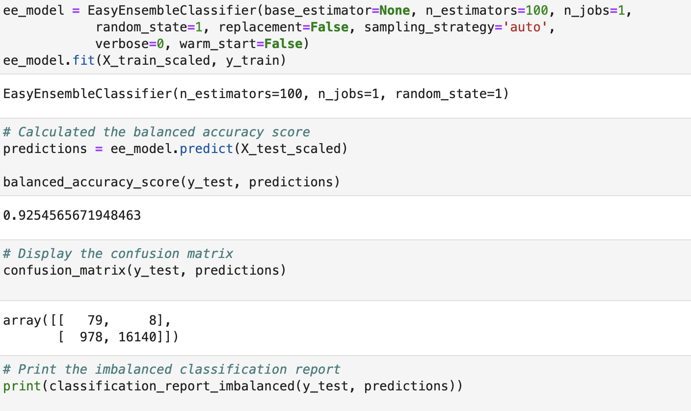

# Classification - Utilizing machine learning to predict credit risk
 

This Machine-Learning project aims to very a variety of credit risk factors and analyze the riskiness level of approving credit. The models include Balance Random Forest, EasyEnsemble, Logicstic Regression in addition to resempling techniques for re-sampling the data to fit the models: Oversampling/SMOTE, Undersampling/Cluster Centroids, and SMOTEENN. 
In order to evaluate the metrics and algorithms used, were used the accuracy score, classification report and confusion matrix to compare models and determine effectiveness.

## Files

[Resampling Starter Notebook](Starter_Code/credit_risk_resampling.ipynb)

[Ensemble Starter Notebook](Starter_Code/credit_risk_ensemble.ipynb)

[Lending Club Loans Data](Resources/LoanStats_2019Q1.csv.zip)

### Resampling Starter Notebook:

*Data Pre-processing*

*Logistic Regression*

*Naive Random Oversampling*

*SMOTE Oversampling*

*Under sampling*

*SMOTEEN Under&Over-sampling*

_RESULTS_
    - Out of the 4 models, SMOTEEN had the best accuracy score at 0.994668%
    - All models returned the recall at the same rate of %0.99
    - All models apart from simple logistic returned a mean geometric of %0.99

### Ensemble Starter Notebook:

*Balanced Random Forest Classifier*

*Easy ensemble classifier*

_RESULTS_
    - Out of the two models, Easy Ensemble Classifier had the best accuracy score at 0.92%
    - Out of the two models, Easy Ensemble Classifier had the best recall score at 0.94%
    - Out of the two models, Easy Ensemble Classifier had the best Geometric score at 0.93%
    - The top three features are: total_rec_prncp (.083), total_pymnt_inv (0.069) and last_pymnt_amnt (0.061).
